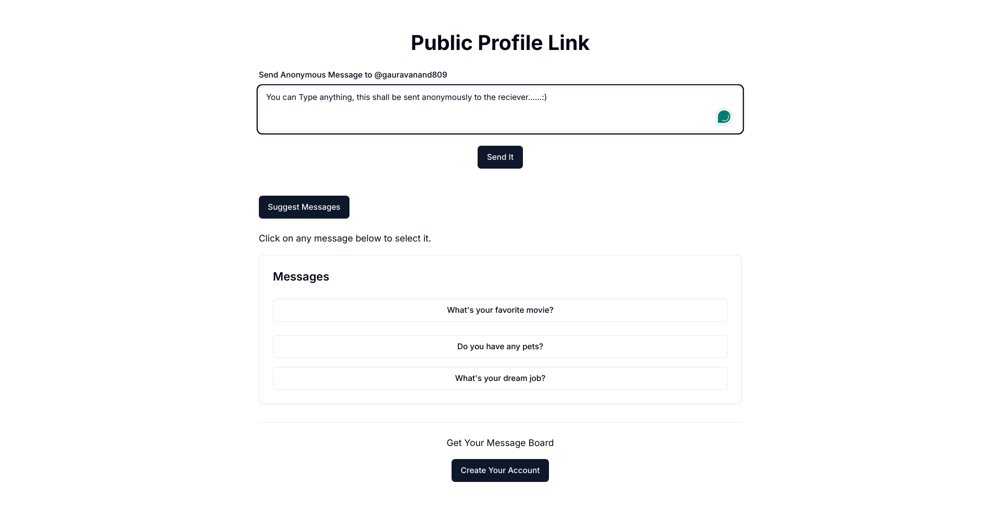
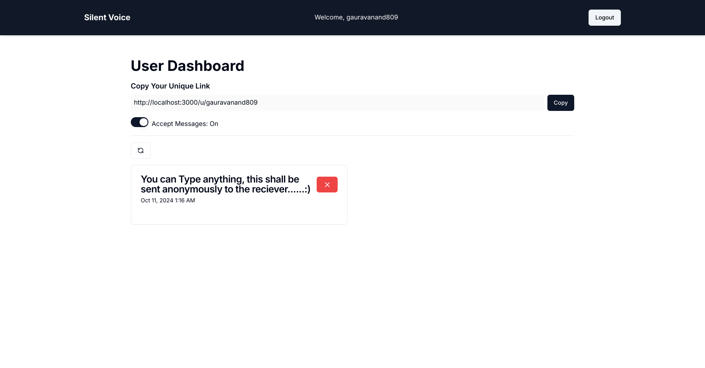

# SilentVoice

SilentVoice is a Next.js-based web application that allows users to send and receive anonymous feedback in a safe and secure manner. It supports features like user authentication, message sending and retrieval, message suggestions, and more, ensuring privacy and ease of use for both feedback givers and receivers.

## Features

- **Anonymous Messaging**: Users can send anonymous messages, ensuring that the feedback remains unbiased and true.
- **Authentication**: Secure sign-up and login using NextAuth for authentication.
- **Unique Username Check**: Ensures that each username is unique during the sign-up process.
- **Message Management**: Users can send, receive, and delete feedback messages.
- **Message Suggestions**: The system can suggest potential messages based on certain criteria.
- **Email Verification**: Users receive a verification code via email to confirm their accounts.



## Project Structure

```bash
├── app
│   ├── api                     # API routes for handling backend requests
│   │   ├── accept-messages      # Accept messages endpoint
│   │   ├── auth                 # Authentication routes (NextAuth integration)
│   │   ├── check-username-unique# Check if a username is unique
│   │   ├── delete-message       # Delete a specific message by ID
│   │   ├── get-messages         # Retrieve messages for a user
│   │   ├── send-message         # Send anonymous messages
│   │   ├── sign-up              # Handle user sign-up
│   │   ├── suggest-messages     # Suggest messages for a user
│   │   └── verify-code          # Email verification code route
│   ├── (app)                    # Main application pages
│   ├── (auth)                   # Authentication pages (sign-in, sign-up, verify)
│   ├── globals.css              # Global styles
│   └── u                        # User pages (e.g., user profile)
├── components                   # Reusable UI components
│   ├── MessageCard.tsx          # Component for displaying messages
│   ├── Navbar.tsx               # Navigation bar component
│   └── ui                       # UI components such as buttons, forms, etc.
├── context                      # React context for managing authentication state
│   └── AuthProvider.tsx         # Context provider for authentication
├── helpers                      # Helper functions
│   └── sendVerificationEmail.ts # Utility to send verification emails
├── lib                          # Library functions (e.g., database connection)
├── middleware.ts                # Custom middleware for handling requests
├── model                        # Mongoose model for MongoDB
│   └── User.ts                  # User model schema
├── schemas                      # Validation schemas for requests
├── types                        # TypeScript definitions and types

```

Tech Stack
- Next.js: For server-side rendering and building the frontend.
- NextAuth: Authentication solution for handling user sign-up and login.
- TypeScript: Type-safe JavaScript for clean and efficient development.
- MongoDB: Database for storing user data and feedback messages.
- Resend API: For sending email verification codes.

## Installation and Setup
- Clone the repository:
```bash
git clone https://github.com/your-repo/silentvoice.git
cd silentvoice    
npm install
```

# .env
``` bash
NEXTAUTH_SECRET="=" 
MONGODB_URI=""
RESEND_API_KEY=""
OPENAI_API_KEY=""
```

```bash
npm run dev
```
API Endpoints
- POST /api/auth/sign-up: Sign up a new user.
- POST /api/auth/sign-in: Sign in an existing user.
- GET /api/get-messages: Get all messages for the authenticated user.
- POST /api/send-message: Send an anonymous message to a user.
- DELETE /api/delete-message/[messageid]: Delete a specific message.
- POST /api/verify-code: Verify the user's email with a code.
- POST /api/check-username-unique: Check if a username is unique.

## Contributing
- Contributions are welcome! If you'd like to contribute, feel free to submit a pull request or raise an issue for discussion.


